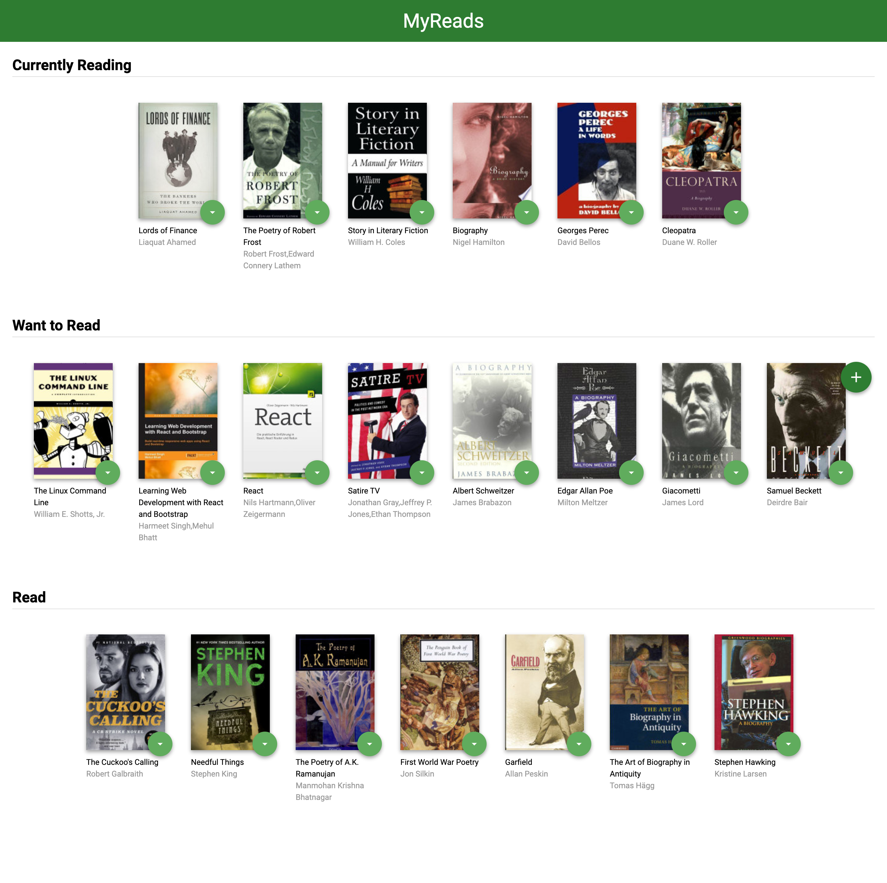
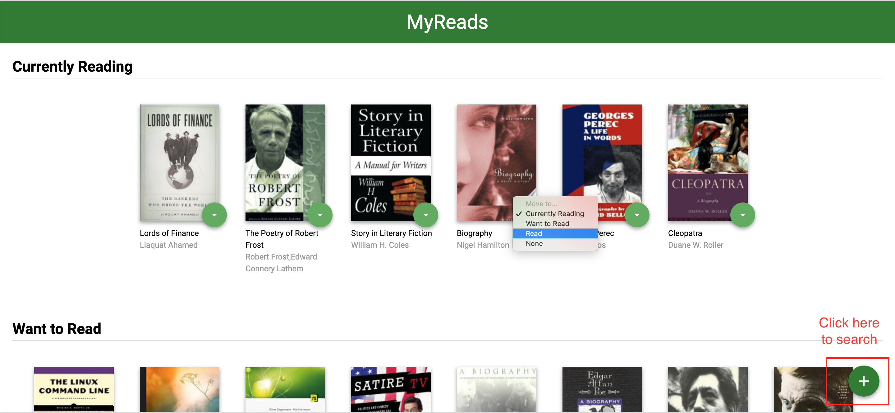
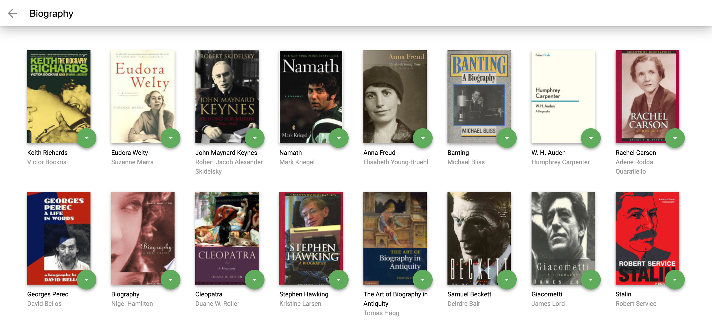
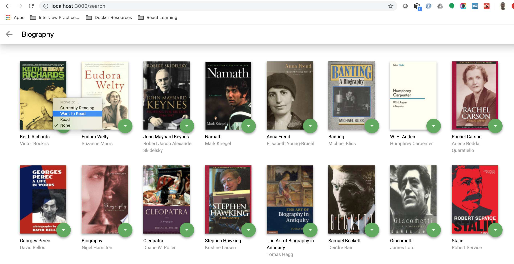

# MyReads Udacity

## Project Objective
This is this a simple complete react App that connects to a book API and allows you to manage books in shelves. User can add a book to "Currently Reading", "Want to Read" and "Read" Shelves. This project is to demonstrate understanding of using components, props and managing state in React.

## Have a feel of the app
The app has been hosted on Netlify. Access with the link below.
https://reactreadsapp.netlify.com/


## How to run the Program on Your Computer
You’ll need to have Node >= 8.10 on your local development machine (but it’s not required on the server). You can use [nvm](https://github.com/creationix/nvm#installation) (macOS/Linux) or [nvm-windows](https://github.com/coreybutler/nvm-windows#node-version-manager-nvm-for-windows) to switch Node versions between different projects.

Locate the path of the project and install the dependencies with the command below

```
git clone https://github.com/kwabena53/reactnd-project-myreads.git
npm install
```

Run the following command to start the app on your local service http://localhost:3000/ 

```
npm start
```


### Functionalities of the App
The application allows users to 
* [`View Book list`](#View Book List) Divided into Currently Reading, Want to Read and Read Shelf
* [`Update the category`](#Update Category) of a book
* [`Search for books`](#Search for books)
* [`Add a new book`](#Add a new book) to your shelf


### `View Book List`
The main page shows 3 shelves for books. Each book is shown on the correct shelf, along with its title and all of its authors.



### `Update Category`
The main page shows a control that allows users to move books between shelves. The control should be tied to each book instance. 



### `Search for books`
As the user types into the search field, books that match the query are displayed on the page, along with their titles and authors. Search results are not shown when all of the text is deleted out of the search input box. 



### `Add a new book`
Search results on the search page allow the user to select “currently reading”, “want to read”, or “read” to place the book in a certain shelf.

If a book is assigned to a shelf on the main page and that book appears on the search page, the correct shelf should be selected on the search page. If that book's shelf is changed on the search page, that change should be reflected on the main page as well. The option "None" should be selected if a book has not been assigned to a shelf.




## Search Terms

There are keywords that you may use to search to derive results from the API.

For details, check out [SEARCH_TERMS.md](SEARCH_TERMS.md).
